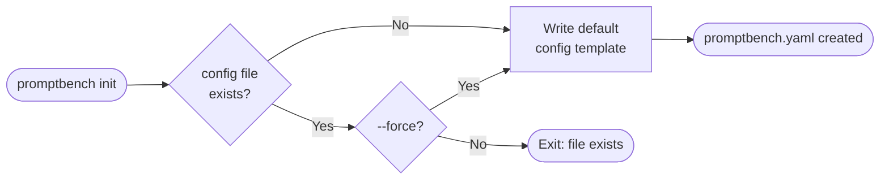
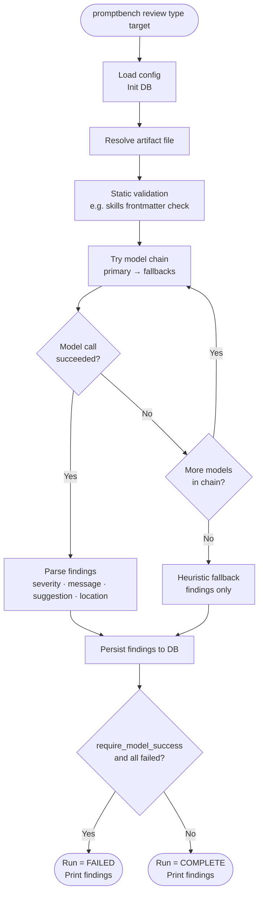
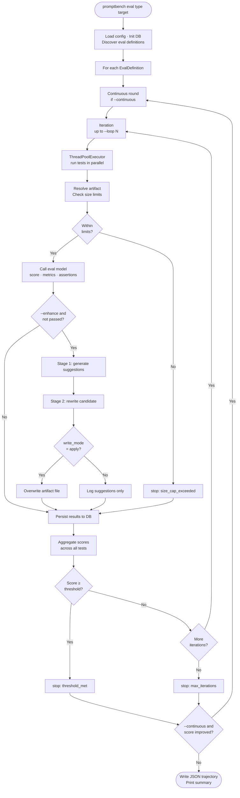

# PromptBench

> CLI for evaluating and iteratively improving agent artifacts — skills, prompts, agents, tools, and instructions.

[](https://www.python.org/)
[](LICENSE)

---

## Features

- **Review** — static validation and structured feedback on any artifact
- **Eval** — run test suites against an artifact, score results, track history
- **Enhance** — iterative LLM-powered rewrite loop with convergence detection
- **Eval-all** — aggregate evaluation across all discovered artifacts of a type
- **Eval-merge** — merge multiple artifacts of one type, seed tests, then run eval loop
- **Report** — JSON or Markdown summary of all runs in the local database
- **Serve** — local Flask dashboard for browsing runs, artifacts, and metrics
- Structured outputs via `pydantic-ai`; graceful fallback to local heuristics when no model is available

---

## Quick Start

```bash
# 1. Install
pipx install promptbench

# 2. Initialize a project
promptbench init

# 3. Review a skill
promptbench review skills path/to/skill.md

# 4. Evaluate and enhance
promptbench eval skills path/to/skill.md --enhance --loop 3

# 5. Open the dashboard
promptbench serve
```

---

## Installation

### pipx (recommended)

```bash
pipx install promptbench
```

> Requires Python 3.14+. [`pipx`](https://pipx.pypa.io/) installs the CLI into an isolated environment and puts `promptbench` on your PATH.

### pip

```bash
pip install promptbench
```

### Development

```bash
git clone <repo-url>
cd promptbench
mise install        # installs Python + uv via mise
mise x -- uv sync   # installs dependencies
mise x -- uv run -- promptbench --help
```

---

## Commands

| Command                 | Description                                                       |
| ----------------------- | ----------------------------------------------------------------- |
| `init`                  | Initialize a `.promptbench/` config directory in the current repo |
| `review <type> <path>`  | Validate and review a single artifact                             |
| `eval <type> <path>`    | Run eval suite against an artifact                                |
| `eval-all <type>`       | Discover and evaluate all artifacts of a type                     |
| `eval-merge <type> ...` | Merge multiple targets into one artifact and auto-evaluate        |
| `report`                | Print a run summary (JSON or Markdown)                            |
| `serve`                 | Start the local web dashboard                                     |

### eval flags

```
--enhance                   Run enhancement loop after eval
--loop N                    Iterations per eval round (default: 1)
--continuous                Keep improving until score stops changing
--continuous-max-rounds N   Cap on continuous rounds
--concurrency N             Parallel workers (auto-tuned if omitted)
--randomize-model           Shuffle model order (primary + fallbacks)
--no-randomize-model        Disable model shuffling
--model-random-seed N       Make model shuffling deterministic
--output FILE               Write JSON trajectory to file
--no-require-model-success  Don't fail if model calls error out
```

---

## Command Flows

### `init`



---

### `review`



---

### `eval` / `eval-all`

`eval` targets one artifact. `eval-all` discovers all artifacts of the given type and runs the same loop for each.



---

## Configuration

PromptBench reads a YAML config (default: `.promptbench/config.yaml`, override with `--config`).

```yaml
objects:
  defaults:
    max_line_count: 200
    max_token_count: 4096
  skills:
    max_line_count: 150 # per-type override

output:
  database_path: .promptbench/runs.db

policies:
  require_model_success: true # fail run if model call errors

providers:
  registry:
    my-provider:
      base_url: https://api.openai.com/v1
      max_concurrency: 5

workflows:
  enhance:
    write_mode: apply # rewrite artifact in-place during loop
```

Key config keys:

- `objects.defaults.max_line_count` / `max_token_count` — global artifact size limits
- `objects.skills|prompts|agents|tools|instructions` — per-type overrides
- `object_limits` inside an eval definition — per-eval override
- `policies.require_model_success` — default `true`; set `false` to allow runs without a live model
- `policies.model_random_seed` — optional deterministic seed for model randomization
- `providers.registry.<id>.max_concurrency` — per-provider parallelism cap

Model routing notes:

- `providers.workflows.judge` can be configured separately from `eval` and `review`
- Eval scoring prefers `judge`, then falls back to `eval`
- Review prefers `review`, then falls back to `judge`
- Enhance prefers `enhance`, then falls back to `judge`

---

## Local LLMStudio (E2E Testing)

`promptbench.local.yaml` is pre-configured for [LM Studio](https://lmstudio.ai/):

- Base URL: `http://localhost:1234/v1`
- Primary model: `llmstudio/nvidia/nemotron-3-nano-4b`
- Fallback model: `llmstudio/essentialai/rnj-1`

Sample artifacts and eval definitions live under `samples/e2e/`.

```bash
# Optional — only needed if your LM Studio endpoint requires a key
export LLMSTUDIO_API_KEY=dummy

# Review
promptbench review skills sample-skill.md \
  --config promptbench.local.yaml \
  --repo .

# Eval + enhance
promptbench eval skills sample-skill.md \
  --enhance --loop 3 \
  --concurrency 2 \
  --continuous --continuous-max-rounds 3 \
  --config promptbench.local.yaml \
  --repo .

# Eval-all
promptbench eval-all skills --loop 2 \
  --continuous --continuous-max-rounds 3 \
  --config promptbench.local.yaml \
  --repo .

# Report
promptbench report --format markdown \
  --config promptbench.local.yaml \
  --repo .

# Dashboard
promptbench serve --host 127.0.0.1 --port 8080 \
  --config promptbench.local.yaml \
  --repo .
```

---

## Dashboard

```bash
promptbench serve --host 127.0.0.1 --port 8080
```

Routes:

| Route             | Description                 |
| ----------------- | --------------------------- |
| `/`               | Overview                    |
| `/runs`           | All eval runs               |
| `/runs/<id>`      | Single run detail           |
| `/artifacts`      | All tracked artifacts       |
| `/artifacts/<id>` | Artifact history and scores |
| `/metrics`        | Aggregate metrics           |

---

## Stack

| Layer                      | Technology                                                                      |
| -------------------------- | ------------------------------------------------------------------------------- |
| CLI                        | [Typer](https://typer.tiangolo.com/)                                            |
| Config & structured output | [Pydantic](https://docs.pydantic.dev/) + [PydanticAI](https://ai.pydantic.dev/) |
| Persistence                | [SQLModel](https://sqlmodel.tiangolo.com/) + SQLite                             |
| Dashboard                  | [Flask](https://flask.palletsprojects.com/) + Jinja2                            |
| Toolchain                  | [mise](https://mise.jdx.dev/) + [uv](https://github.com/astral-sh/uv)           |

---

## Documentation

| Doc                                    | Description                                    |
| -------------------------------------- | ---------------------------------------------- |
| [Architecture](docs/architecture.md)   | Module map, data flow, persistence schema      |
| [CLI Reference](docs/cli-reference.md) | Every command, flag, and default               |
| [Configuration](docs/configuration.md) | Full YAML schema with all fields               |
| [Workflows](docs/workflows.md)         | Review, eval, enhance internals                |
| [Artifacts](docs/artifacts.md)         | Artifact types, formats, discovery, validation |
| [Dashboard](docs/dashboard.md)         | Web UI routes and API endpoints                |
| [Contributing](docs/contributing.md)   | Dev setup, testing, conventions                |

---

## Contributing

1. Fork and clone
2. `mise install && mise x -- uv sync`
3. Run tests: `mise x -- uv run -- pytest`
4. Open a PR against `main`

> Development uses `mise` + `uv` — see [Installation → Development](#development) above.
